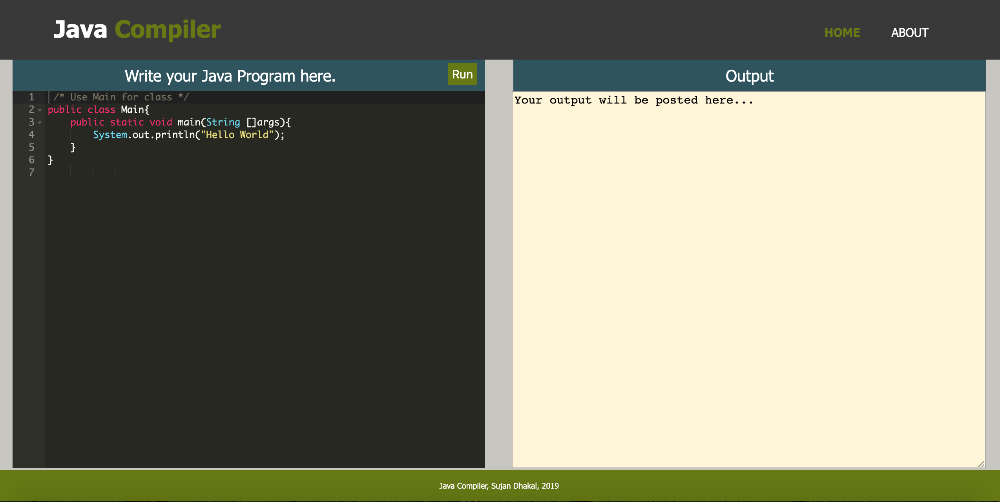
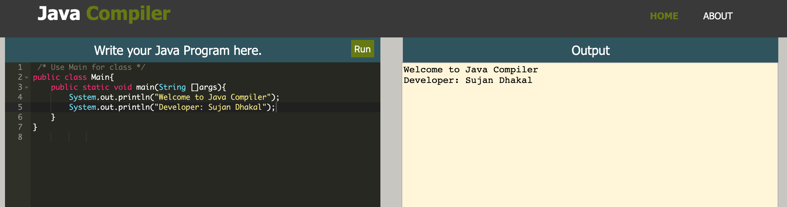

# Java Compiler
  - An online Java Compiler
  - Fully responsive web design for all device platforms- mobile, tablets, laptop and desktops.
  - Frontend: HTML, CSS, JavaScript, jQuery
  - Backend: Node.js, Express.js
  - Developer: Sujan Dhakal
 
How to run?

    - Open terminal and navigate into the directory. cd Java_Compiler
    - npm install
    - node app (Port: 3100)
    - Open browser and visit: http://localhost:3100/
 
Home Page Preview:

 
 
Sample Output Preview:
 

 
